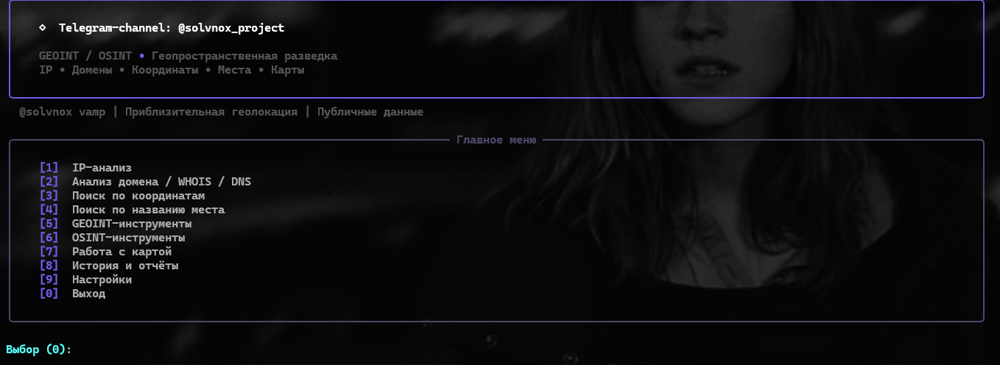
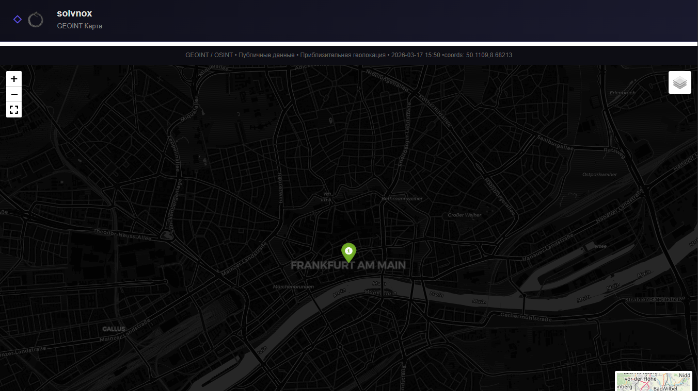
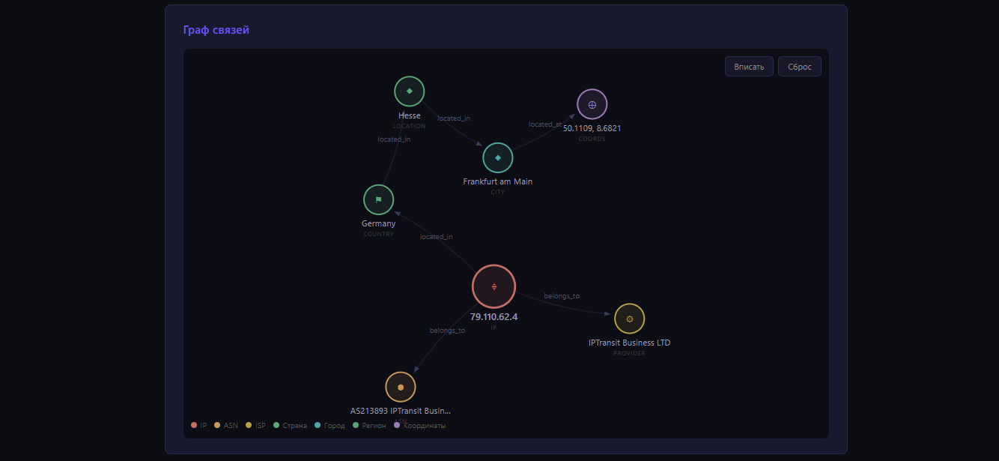

# solvnox GEOINT / OSINT CLI

Интерактивная утилита геопространственной разведки (GEOINT/OSINT) с меню на русском языке  

## Установка

```bash
cd geoint_cli
pip install -r requirements.txt
```

## Запуск

```bash
python main.py
```
<p align="center">
  
</p>

<h1 align="center">Solvnox</h1>

<p align="center">
  Tollkit of GeoINT
</p>


CLI менюшка

Карта 

Граф связей
